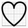
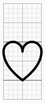
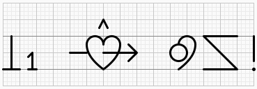

# Bliss SVG Builder - SVG Generator for Blissymbolics

A JavaScript library for generating SVG representations of **Blissymbolics (Bliss)**, an ideographic language, using a compact Domain-Specific Language (DSL).

[](https://www.npmjs.com/package/bliss-svg-builder)  

Bliss SVG Builder enables you to **programmatically generate Bliss characters and compositions** in your JavaScript applications. It's designed to power AAC applications, educational tools, communication boards, and any system that needs to **write, render, or display Bliss dynamically.**

Bliss-SVG-Builder ships with a built-in set of more than 1,100 Bliss characters and 450 graphical shapes defined using the same recursive composition system available to users. You can use these directly, or define your own Bliss characters as needed.

## Installation

```bash
npm install bliss-svg-builder@alpha
```

## Quick Start

```javascript
import { BlissSVGBuilder } from 'bliss-svg-builder';

// Create a builder instance with your DSL input
const builder = new BlissSVGBuilder('B313');

// Get SVG as string
const svgCode = builder.svgCode;

// Or get DOM element (browser)
const svgElement = builder.svgElement;
document.getElementById('container').appendChild(svgElement);
```

## Examples

**Simple shape** - Heart with freestyle mode

```
[freestyle=1;background=#fafafa]||H
```



**Bliss character** - B313 (FEELING)

```
[grid=1;background=#fafafa]||B313
```



**Bliss sentence** - "I love Blissymbolics!"

```
[grid=1;background=#fafafa]||B513/B10//B431;B81//B414/B167//B1
```



## Compatibility

This package supports the three major JavaScript module systems:
**ES Modules (ESM), CommonJS (CJS), and UMD**.

As a result, it works in:

- Modern browsers (ESM or UMD)
- Node.js (ESM or CJS)
- Bundlers (Vite, Webpack, Rollup, Parcel, etc.)
- Script tags and legacy setups (UMD)

## Documentation

For complete documentation including DSL syntax, shapes reference, options, and examples, visit the **[Full Documentation](https://hlridge.github.io/bliss-svg-builder/)**.

- [Get Started](https://hlridge.github.io/bliss-svg-builder/get-started/installation-setup)
- [Handbook](https://hlridge.github.io/bliss-svg-builder/handbook/core-concepts/characters-bcodes)
- [Reference](https://hlridge.github.io/bliss-svg-builder/reference/shapes-gallery)

## Stability Notice

**Alpha Software**: This package is in active development. Breaking changes may occur without notice. Use at your own risk.

## License

This project is licensed under the Mozilla Public License 2.0. See the [LICENSE](./LICENSE) file for details.

---

**Keywords:** Blissymbolics, Bliss, Blissymbols, Semantography, Blissary, AAC, ideographic language, SVG, DSL, augmentative communication, symbol composition, accessibility
