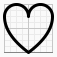
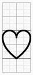
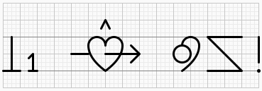

# Bliss SVG Builder - SVG Toolkit for Blissymbolics

A JavaScript library for composing, inspecting, and manipulating **Blissymbolics (Bliss)** symbols, with SVG output for display in browsers and Node.js.

[](https://www.npmjs.com/package/bliss-svg-builder)  

Bliss SVG Builder lets you **build Bliss characters, words, and sentences** from a compact DSL, then **modify, query, and render** the results. It's designed to power websites, AAC applications, educational tools, communication boards, and any project that works with Bliss.

Bliss-SVG-Builder ships with a built-in set of more than 1,100 Bliss characters and 450 graphical shapes defined using the same recursive composition system available to users. You can use these directly, or define your own Bliss characters as needed.

## Installation

```bash
npm install bliss-svg-builder@next
```

## Quick Start

```javascript
import { BlissSVGBuilder } from 'bliss-svg-builder';

// Create a builder instance with your DSL input
const builder = new BlissSVGBuilder('B313');

// Get SVG as string
const svgCode = builder.svgCode;

// Or get DOM element (browser)
const svgElement = builder.svgElement;
document.getElementById('container').appendChild(svgElement);
```

## Examples

**Simple shape** - Heart with auto-vertical crop

```
[crop=auto-vertical;background=#fafafa]||H
```



**Bliss character** - B313 (FEELING)

```
[grid;background=#fafafa]||B313
```



**Bliss sentence** - "I love Blissymbolics!"

```
[grid;background=#fafafa]||B513/B10//B431;B81//B414/B167//B1
```



## Compatibility

This package supports the three major JavaScript module systems:
**ES Modules (ESM), CommonJS (CJS), and UMD**.

As a result, it works in:

- Modern browsers (ESM or UMD)
- Node.js (ESM or CJS)
- Bundlers (Vite, Webpack, Rollup, Parcel, etc.)
- Script tags and legacy setups (UMD)

## Documentation

For complete documentation including DSL syntax, mutation API, element inspection, shapes reference, options, and more, visit the **[Full Documentation](https://hlridge.github.io/bliss-svg-builder/)**.

- [Get Started](https://hlridge.github.io/bliss-svg-builder/get-started/installation-setup)
- [Handbook](https://hlridge.github.io/bliss-svg-builder/handbook/writing/characters-bcodes)
- [Reference](https://hlridge.github.io/bliss-svg-builder/reference/shapes-gallery)

## Stability Notice

**Release Candidate**: The API is considered stable. Breaking changes are unlikely but possible before the final 1.0.0 release.

## License

This project is licensed under the Mozilla Public License 2.0. See the [LICENSE](./LICENSE) file for details.

---

**Keywords:** Blissymbolics, Bliss, Blissymbols, Semantography, Blissary, AAC, ideographic language, SVG, DSL, augmentative communication, symbol composition, accessibility
